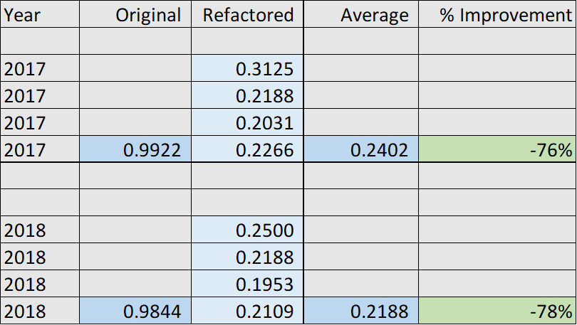
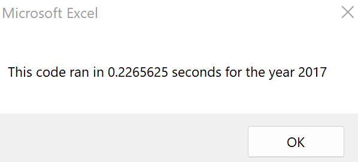
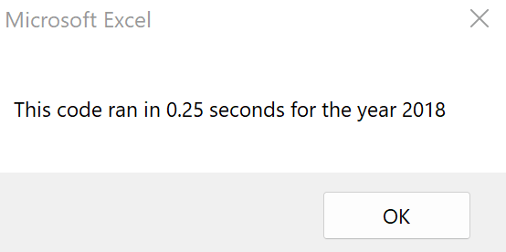

# VBA of Wall Street

2022-07-02

LaStella, Laurina

README for DABC Module 2: VBA

## Overview of Project

### Refactoring the code created during the Module 2 VBA process. Based on stock market data points broken out by day, use VBA code to summarize metrics by year. Streamline the code from the original tutorial to run faster. Refactoring includes reducing the number of loops, and using new variables to change the sequence of the loop processes.

## Results

### Run Time Improvements
Run time was reduced by 76% for 2017, and 78% for 2018. These percentages are based on the average of four runs of the refactored code.

Example run time, 2017,

Example run time, 2018,

## Summary

1. What are the advantages or disadvantages of refactoring code?
    - Advantages:
        - Faster run time.
        - More efficient usage of system resources.
        - Code can potentially be more easily interpreted and edited by other coders.

    - Disadvantages: 
        - Every touch point introduces the possibility of new errors.
        - Time spent editing code may not always be balanced out by time saved by faster code processing.
        - Code can potentially be more confusing when edited by other coders.

2. How do these pros and cons apply to refactoring the original VBA script?
    - Run times were improved by more than 75%.
    - Time investment to edit code was significant.

